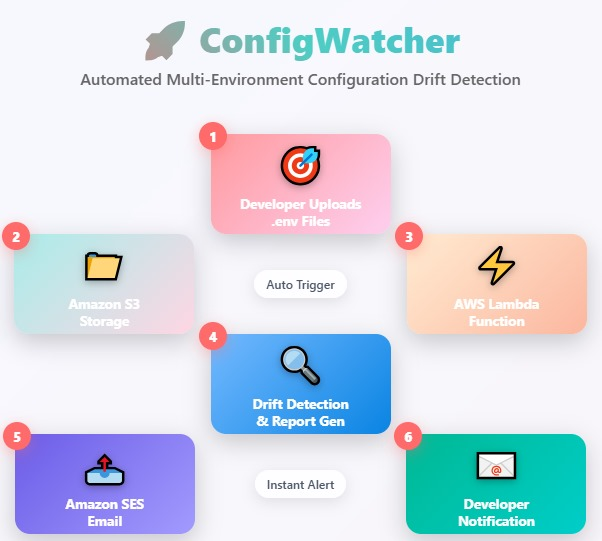

# 🏆 Hackathon Submission: ConfigWatcher

## 🚀 Problem: Configuration Chaos
In today's cloud world, inconsistent settings (like API keys or database hosts) across different environments (local, staging, production) can silently break your apps. Manual checks are slow and error-prone.

## 💡 Solution: ConfigWatcher
ConfigWatcher is a serverless tool that automatically finds differences in .env configuration files across your environments. It then sends clear, easy-to-read reports directly to your email. Built with AWS services, it ensures your configurations stay consistent and gives DevOps teams peace of mind.

<p align="center">
  
</p>


## 🔍 How It Works
ConfigWatcher compares your local.env, staging.env, and production.env files. Whenever you upload a new .env file to S3, it triggers an AWS Lambda function. This function then:

1. Fetches all .env files from S3.
2. Compares keys and values to find any discrepancies.
3. Generates a detailed drift report.
4. Sends this report via Amazon SES to your inbox.

It detects missing keys or mismatched values, giving you real-time feedback when your configs drift.

## ✨ Key Features
- **Event-Driven**: Triggers automatically on S3 file uploads.
- **Serverless**: Powered by AWS Lambda for efficiency.
- **Email Alerts**: Sends rich HTML and plain-text reports via Amazon SES.
- **Clear Output**: Provides readable reports, not raw data dumps.
- **Cost-Effective**: Scalable and fits within the AWS Free Tier.
- **Real-Time Feedback**: Get alerts as soon as drift occurs.

## 🛠️ AWS Tools & Services Used
- **AWS Lambda**: Runs the core drift detection logic and sends emails.
- **Amazon S3**: Stores your .env configuration files and generated drift reports.
- **Amazon SES**: Handles sending email drift reports.
- **AWS IAM**: Provides secure permissions for Lambda to access S3 and SES.
- **Amazon CloudWatch**: Logs details of Lambda executions for monitoring and debugging.
- **S3 Trigger**: Automatically starts Lambda when .env files are uploaded.

## 🧩 How ConfigWatcher Uses AWS Lambda
1. **Event-Driven**: Lambda is triggered automatically by S3 PUT events when a .env file is uploaded.
2. **Drift Detection**: Lambda fetches all .env files from S3, compares them, and detects configuration drift.
3. **Report Generation**: Lambda generates a detailed HTML and plain-text drift report.
4. **Email Notification**: Lambda sends the report via Amazon SES to your inbox.
5. **Logging**: Lambda logs execution details to CloudWatch for traceability.

**Diagram:**
```
[User Uploads .env to S3] → [S3 Trigger] → [AWS Lambda] → [S3 (fetch & store reports)] → [SES (send email)] → [Inbox]
```
<p align="center">
  
</p>

## 🧪 Testing & Verification
- **Email Test**: Upload a new .env file to your S3 bucket. You should receive a drift report email from SES within seconds.
- **S3 Report Test**: Check your S3 bucket for a generated drift report file (HTML or text) after upload.
- **CloudWatch Logs**: Inspect Lambda execution logs in CloudWatch for detailed run information.


## 📦 Deployment Guide
1. **S3 Setup**: Upload local.env, staging.env, and production.env to your S3 bucket.
2. **Amazon SES Setup**: Verify sender and receiver email addresses.
3. **Lambda Deployment**: Upload lambda_function.py, set runtime to Python 3.x.
4. **IAM Role**: Grant Lambda permissions for S3 Read, SES Send, and CloudWatch Logs.
5. **Enable S3 Trigger**: Configure a trigger on PUT events for .env files in your bucket.

6. **Test & Verify**: Follow the testing steps above to ensure everything works as expected.

## 🎥 Demo Video
https://vimeo.com/1095505331?share=copy#t=0

---
ConfigWatcher is a self-healing watchdog for your configurations. It's a zero-UI tool focused entirely on value, providing an inbox-first experience for developers. It's designed as a real-world tool to transform a painful, manual DevOps task into a streamlined, automated process that's also AWS Free Tier compatible.
